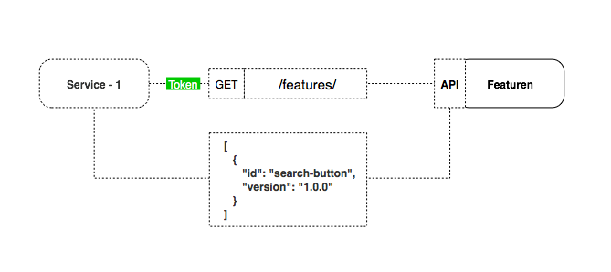

<H1 align='center'> Featuren </H1>

    <em>A simple application for managing your features in production.</em>

---

# Introduction

Feature flags / toggle give a software organization the power to reduce risk, iterate quicker, and gain more control. Feature flags allow you to decouple feature rollout from code deployment. This separation allows you unprecedented control of who sees what when, independent of release. And the “you” can be anyone in your organization – from developers, ops, designers, product managers, or marketers. Allowing control over a release unlocks the true power of your software.

The main goal for this project is create a simple and open source application for managing your features in production.

